# Steam Protocol & Architecture

Internal documentation covering every layer of the go-steam library: authentication, CM sessions, app info, CDN chunk downloads, and the full app/workshop download pipelines.

---

## Table of Contents

1. [Overview](#overview)
2. [Authentication](#authentication)
3. [CM Session](#cm-session)
4. [App Info (PICS)](#app-info-pics)
5. [CDN — Manifests](#cdn--manifests)
6. [CDN — Chunks](#cdn--chunks)
7. [App Download Pipeline](#app-download-pipeline)
8. [Workshop Download Pipeline](#workshop-download-pipeline)
9. [Cache / Store](#cache--store)
10. [API Reference](#api-reference)

---

## Overview

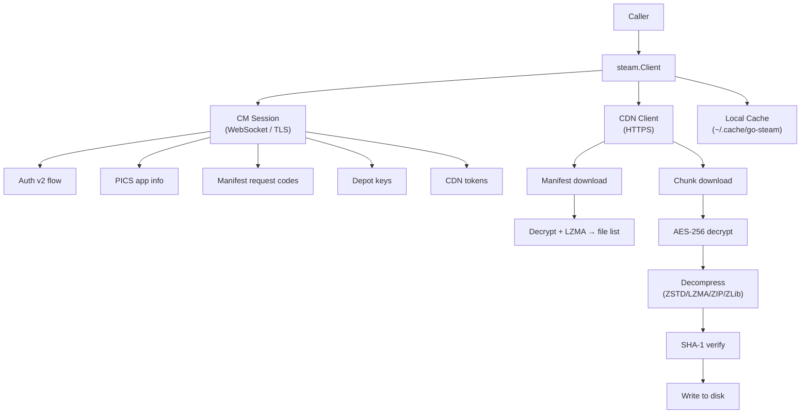

---

## Authentication

### Session types

| Session | When used | Capabilities |
|---------|-----------|--------------|
| Anonymous | No credentials given, or as second session for PICS lookup | Free apps, public depot info |
| Authenticated | `Config.Username` is set | Paid apps, workshop, encrypted depots |

The library always creates an anonymous CM session. An authenticated session is created on top of it when credentials are provided.

### Authenticated flow — Steam Auth v2

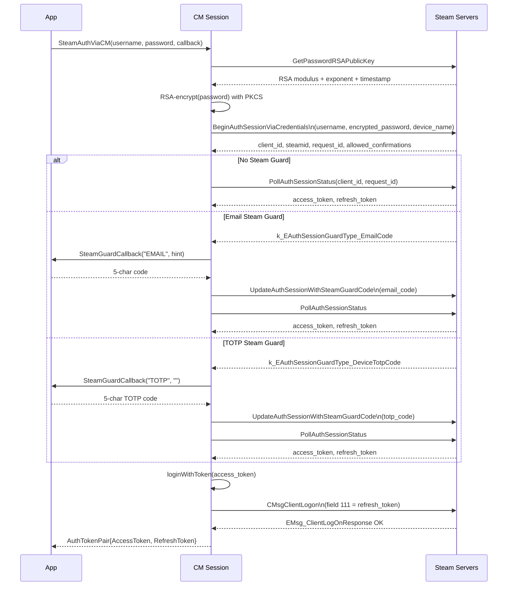

The `SteamGuardCallback` signature is:
```go
type SteamGuardCallback func(guardType string, emailHint string) (code string, err error)
```

Built-in callbacks:

| Function | Behaviour |
|----------|-----------|
| `steam.InteractiveSteamGuard` | Prompts stdin |
| `steam.UnknownSteamGuard` | Returns error immediately (default if nil) |

For TOTP automatic generation use `cmd/guard` or call `totp.GenerateAuthCode(base64Secret)` directly.

### Token caching

After a successful auth the `CachedSession` is written to `<CachePath>/session_<username>.json`:

```json
{
  "account_name": "myaccount",
  "access_token": "eyJ...",
  "expiry": "2026-07-14T12:00:00Z"
}
```

On the next run `New()` reads this file. If the token is still valid it calls `loginWithToken` directly — no password exchange needed.

---

## CM Session

### Connection lifecycle

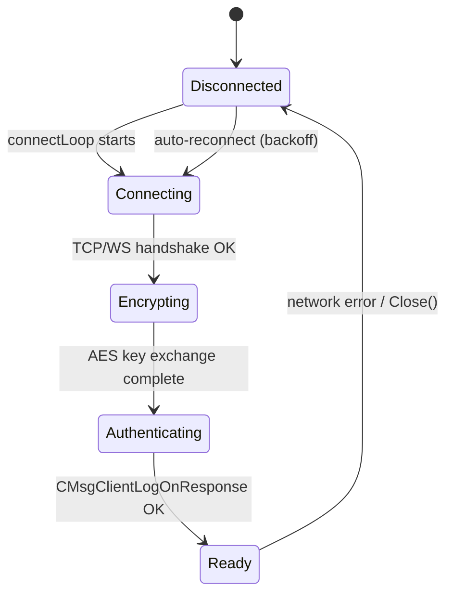

### Transport options

| Transport | When chosen | Encryption |
|-----------|-------------|------------|
| WebSocket (`wss://`) | CM server advertises a WS endpoint | TLS (no additional layer) |
| TCP | Fallback | Steam AES handshake (see below) |

**TCP AES handshake:**

1. Client sends a `ChannelEncryptRequest` with a supported protocol version.
2. Steam responds with `ChannelEncryptResult` containing a RSA-encrypted random session key.
3. Client decrypts with Steam's embedded RSA public key, derives the AES-256 key.
4. All subsequent TCP frames are AES-ECB-IV+CBC encrypted.

WebSocket transport skips this (TLS provides the channel security).

### Message framing

**TCP frame:**
```
[payload_length : uint32 LE]
[magic          : uint32 LE = 0x31305456 "VT01"]
[payload        : proto-encoded CMsgProtoBufHeader + body]
```

**WebSocket frame:** raw binary `payload` with no length prefix.

### Heartbeats

After `ClientLogOnResponse`, the session starts a heartbeat goroutine that sends `CMsgClientHeartBeat` every `out_of_game_heartbeat_seconds` seconds (as reported by the logon response, default 5 s). Missed heartbeats cause the CM to disconnect.

### Dispatcher

All messages share a single `Dispatcher`. Outgoing requests are tagged with a monotonically-increasing `jobID`. The response handler matches `jobID` in incoming headers to unblock the waiting goroutine.

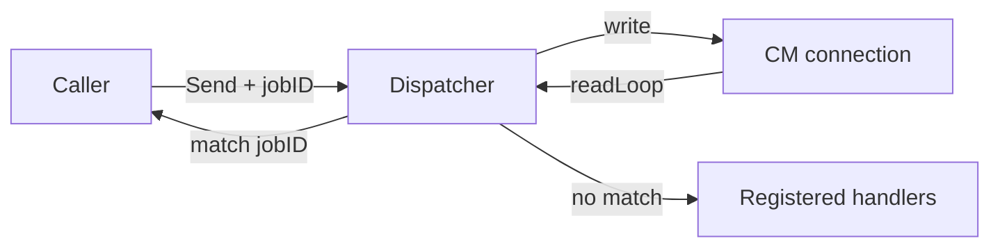

`CMsgMulti` responses (batched by Steam) are transparently unwrapped and each inner message dispatched individually; gzip-compressed multi-payloads are decompressed inline.

---

## App Info (PICS)

PICS (Product Info and Change Set) is Steam's metadata protocol.

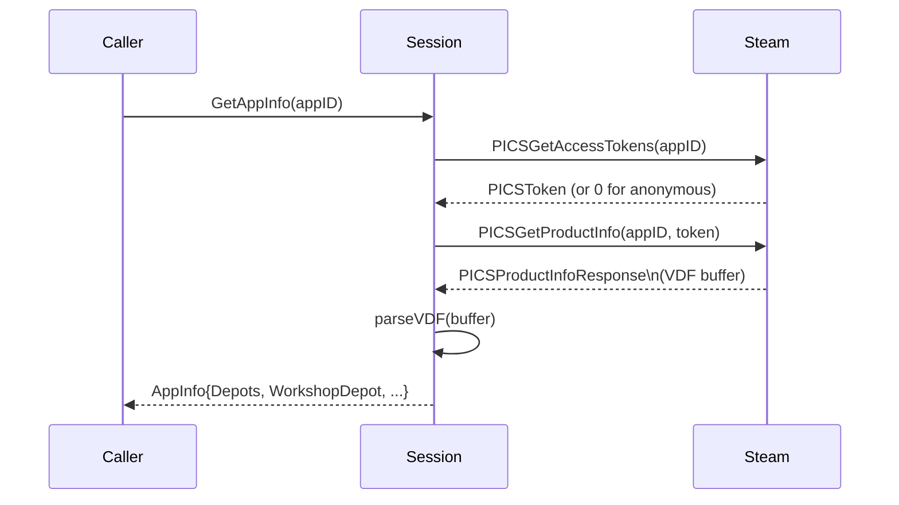

### AppInfo struct

```go
type AppInfo struct {
    AppID         uint32
    Type          string            // "game", "tool", "server", etc.
    Depots        map[uint32]*DepotInfo
    WorkshopDepot uint32            // depot that holds workshop items
}

type DepotInfo struct {
    DepotID                uint32
    AllowAnonymous         bool
    OSList                 string            // "linux", "windows", "macos", comma-separated
    ManifestGIDs           map[string]uint64 // branch → manifest GID (plaintext branches)
    EncryptedManifestGIDs  map[string]string // branch → hex-encoded encrypted GID blob (password-protected branches)
}
```

Results are cached in-process for 5 minutes (TTL per `AppInfoCache`).

### Depot selection (app download)

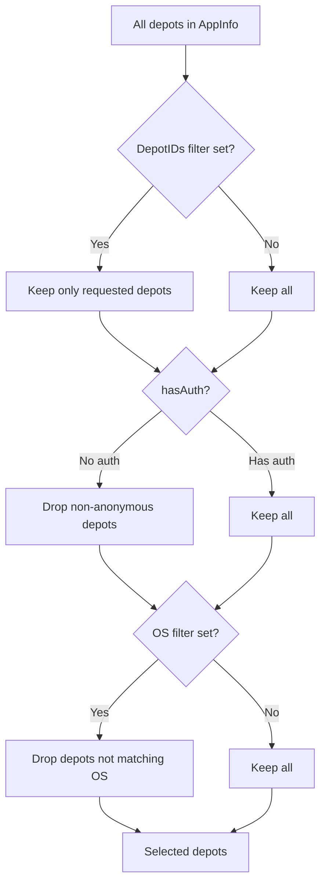

---

## CDN — Manifests

A depot manifest is a signed list of every file in the depot, with per-chunk SHA-1 hashes, offsets, and sizes.

### Download & decode flow

```mermaid
flowchart TD
    A[GetManifestRequestCode\nfrom CM] --> B
    B[GET /depot/ID/manifest/GID/5/CODE] --> C{HTTP status}
    C -->|200| D[Read body]
    C -->|401| E[Refresh CDN token + retry]
    D --> F{first 4 bytes}
    F -->|0x16349781| V4[Steam3 'v4' binary manifest]
    F -->|0x04034B50 'PK'| G[ZIP: extract first entry]
    F -->|other| H[legacy size-prefixed sections]
    G --> I[Magic-prefixed sections\nAES-256 ECB-IV+CBC + LZMA]
    H --> I
    V4 --> K[payload + metadata]
    I --> K[Parse payload + metadata protobufs]
    K --> DF[Decrypt + sort filenames\nif encrypted]
    DF --> L[Manifest{Files, Chunks}]
```

### Container formats

`decodeManifest` detects the manifest container from the first four bytes:

- **`0x16349781` — Steam3 "version 4" binary manifest.** A flat little-endian
  structure (`Steam3Manifest` in SteamKit2): a fixed 64-byte header
  (depotID, manifest GID, creation time, totals, `EncryptedCRC`, …) followed by
  `FileMappingSize` bytes of null-terminated-name file entries, each with its
  chunks, then a trailing magic marker. Parsed directly — no ZIP, no per-section
  LZMA. See `parseSteam3Manifest`.
- **`0x04034B50` ("PK") — ZIP-wrapped protobuf sections.** The current Steam CDN
  format: a single ZIP entry holds magic-prefixed sections
  (`PROTOBUF_PAYLOAD_MAGIC` `0x71F617D0`, `PROTOBUF_METADATA_MAGIC` `0x1F4812BE`,
  …) terminated by `PROTOBUF_ENDOFMANIFEST_MAGIC` `0x32C415AB`.
- **otherwise — legacy size-prefixed sections** (`uint32` length + protobuf bytes).

All three feed the same `ContentManifestPayload` + `ContentManifestMetadata`
structures. When `FilenamesEncrypted` is set, filenames are base64-decoded and
AES-decrypted with the depot key, then the file list is re-sorted alphabetically
(matching SteamKit2 `DecryptFilenames`) so the output is canonical.

### Manifest URL

```
https://<cdn-host>/depot/<depotID>/manifest/<manifestGID>/5/<requestCode>
```

The `requestCode` is obtained from the CM via `ContentServerDirectory.GetManifestRequestCode#1` — a service call that requires an authenticated session for paid depots. Without it the CDN returns HTTP 401.

### Manifest file flags

| Flag | Value | Meaning |
|------|-------|---------|
| `fileExecutable` | `0x20` | `chmod +x` on extract |
| `fileDir` | `0x40` | Entry is a directory |
| (symlink) | detected by `SymlinkTarget != ""` | Symlink |

### ChunkInfo

```go
type ChunkInfo struct {
    SHA1             []byte // 20 bytes — also used as the chunk URL ID
    CRC32            uint32
    Offset           int64
    CompressedSize   uint32
    UncompressedSize uint32
}
```

---

## CDN — Chunks

### Server selection

The CDN client fetches the server list from `https://steamcontentdownload.a.akamaiedge.net/serverlist/<cellID>/20` on startup. Each server has a penalty score; `GetServer()` returns the lowest-penalty server. A server's penalty is increased on every error and decays over time (`Penalise()`).

### Token provider

CDN auth tokens are bearer tokens included in the `Authorization` header. The `TokenProvider` caches them to disk (with a 5-minute safety margin before expiry) and uses `singleflight` to prevent stampeding when many goroutines request the same token simultaneously.

```
GET https://<cdn-host>/depot/<depotID>/manifest/...
Authorization: Bearer <cdn-token>
```

Tokens are depot+host specific and are fetched from the CM via `ContentServerDirectory.GetServersForSteamPipe`.

### Chunk download URL

```
https://<cdn-host>/depot/<depotID>/chunk/<sha1-hex>
```

### Decryption

All chunks are encrypted with the depot key (a 32-byte AES-256 key obtained from the CM):

```
wire_data = AES-ECB(key, rawIV)[16 bytes] || AES-CBC(key, rawIV, ciphertext)
```

The first 16 bytes of the wire data are an AES-ECB-encrypted IV. Decrypt them with a single ECB block to recover `rawIV`, then AES-CBC decrypt the remainder.

### Decompression formats

The format is determined **purely from the magic bytes** of the decrypted payload, matching SteamKit2's `DepotChunk.Process`. There is no size-based "raw" case — a chunk whose compressed and uncompressed lengths happen to match is still wrapped in one of these containers (e.g. a VZip-LZMA chunk that the compressor could not shrink).

```mermaid
flowchart TD
    M[decrypted bytes] --> B{magic bytes}
    B -->|'V','S' ('VSZa')| VZipZSTD[VZip-ZSTD]
    B -->|'V','Z' ('VZa')| VZipLZMA[VZip-LZMA]
    B -->|'P','K',0x03,0x04| ZIP[ZIP deflate]
    B -->|other| ZLib[ZLib RFC 1950]

    VZipLZMA --> L1["header: 'VZ' + version(1) + CRC32(4)"]
    L1 --> L2["LZMA props(5) + stream"]
    L2 --> L3["footer: uncompressed_size(4 LE) + 'zv'"]
    L3 --> LOut[LZMA decompress → output]

    VZipZSTD --> S1["header: 'VSZa'(4) + CRC32(4)"]
    S1 --> S2["ZSTD frame"]
    S2 --> S3["footer: CRC32(4) + uncompressed_size(8 LE) + 'zsv'"]
    S3 --> SOut[ZSTD decompress → output]
```

#### VZip-LZMA wire layout

```
[0-1]   'V', 'Z'               magic
[2]     version byte (='a')
[3-6]   CRC32 LE               CRC of uncompressed data
[7-11]  LZMA props (5 bytes)   lclppb + dictionary size
[12..N-6] LZMA compressed stream
[N-6..N-2] uncompressed_size   uint32 LE footer
[N-2..N]   'z', 'v'            end marker
```

The LZMA stream is decoded by reconstructing the LZMA "alone" format: `props(5) || uncompressedSize(8 LE) || stream`.

#### VZip-ZSTD wire layout

```
[0-3]    'V', 'S', 'Z', 'a'    magic + version
[4-7]    CRC32 LE              CRC of uncompressed data
[8..N-15] ZSTD frame           a single ZSTD frame
[N-15..N-11] CRC32 LE          CRC of uncompressed data (repeated)
[N-11..N-3]  uncompressed_size uint64 LE
[N-3..N]     'z', 's', 'v'     3-byte end marker
```

The 15-byte footer (`CRC32(4) + uncompressed_size(uint64 LE, 8) + 'zsv'(3)`) is stripped before calling `DecodeAll`, so the decoder sees only the ZSTD frame. This is required because `DecodeAll` treats any trailing bytes as a second frame, and a footer CRC that happens to look like a (skippable) ZSTD frame magic would otherwise corrupt the output. The decompressed result is then SHA-1 verified.

> **Note:** the footer's `'zsv'` marker is 3 bytes, not the 2-byte `'zv'` used by VZip-LZMA, and the size field is a `uint64`, not a `uint32`. These were confirmed against real CDN chunks (including SteamKit2's `depot_3441461` ZSTD test vector); see `internal/cdn/steamkit_vectors_test.go`.

### SHA-1 verification

After decompression the SHA-1 of the output is compared against `ChunkInfo.SHA1`. A mismatch returns `errChunkCorrupt` (`IsCorrupt(err) == true`), which triggers the caller to penalise the server and retry from a different CDN host.

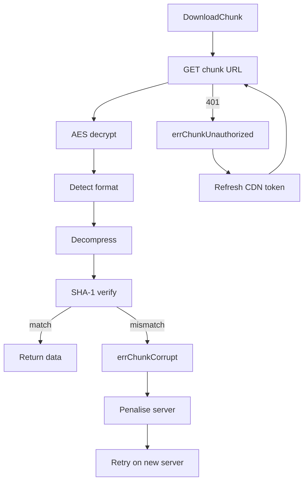

---

## App Download Pipeline

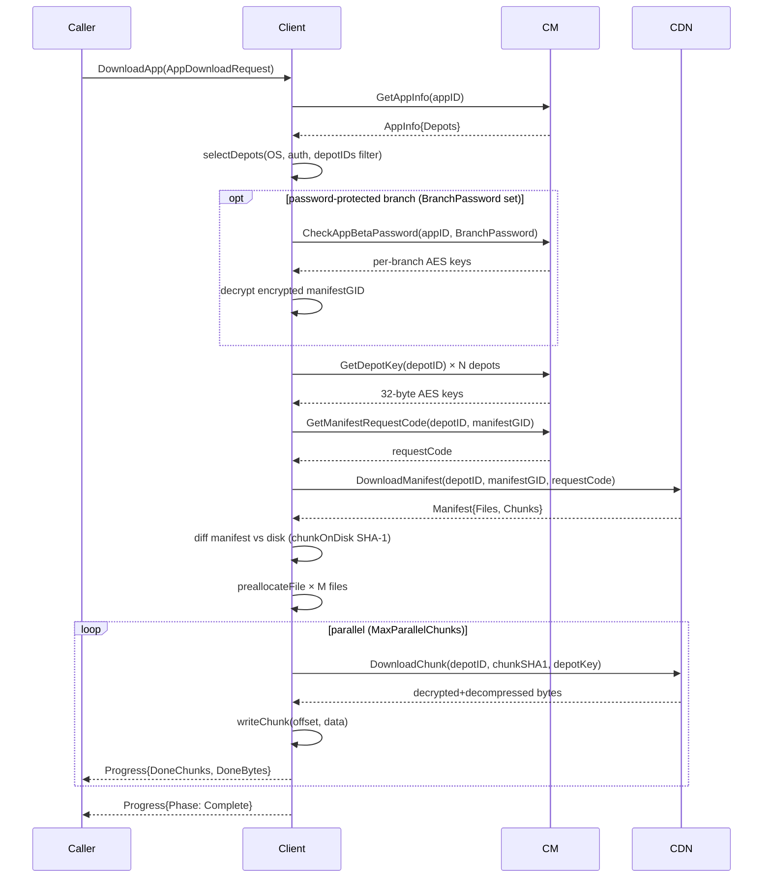

### AppDownloadRequest

```go
type AppDownloadRequest struct {
    AppID          uint32
    DepotIDs       []uint32  // empty = all eligible depots
    Branch         string    // default "public"
    BranchPassword string
    OS             string    // "linux", "windows", "macos", or ""
    Language       string    // e.g. "english"; "" = all
    TargetDir      string    // required
    ValidateOnly   bool      // verify on-disk SHA-1 without writing
}
```

### Password-protected branches

A private beta branch hides its manifest GID: PICS app info lists the branch under
`depots.<id>.encryptedmanifests.<branch>.gid` as a **hex-encoded, AES-encrypted blob**
instead of the plaintext `manifests.<branch>.gid`. The `BranchPassword` is required to
recover the real GID.

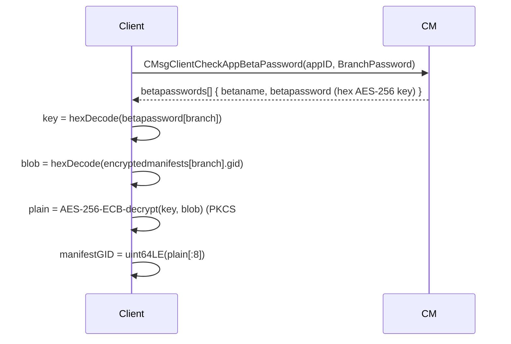

Flow (`resolveManifestGID` + `cm.CheckAppBetaPassword` / `cm.DecryptManifestGID`):

1. If the branch has a plaintext `ManifestGIDs[branch]`, use it directly (some betas are
   not password-protected).
2. Otherwise, when the branch appears in `EncryptedManifestGIDs` and `BranchPassword` is
   set, `DownloadApp` calls `CheckAppBetaPassword(appID, password)` once (EMsg `5450`).
   Steam replies (EMsg `5451`) with one entry per unlocked branch, each carrying a
   hex-encoded **AES-256 key** (not the password).
3. The branch's encrypted GID blob is hex-decoded, **AES-256-ECB** decrypted (PKCS#7
   padding, no IV) with that key, and the first 8 bytes of the plaintext are read as the
   little-endian manifest GID. This matches SteamKit2/DepotDownloader's
   `SymmetricDecryptECB` + `BitConverter.ToUInt64`.
4. A missing/invalid password (no key returned for the branch) is a hard error — the
   download does **not** silently fall back to the public branch.

### Concurrency model

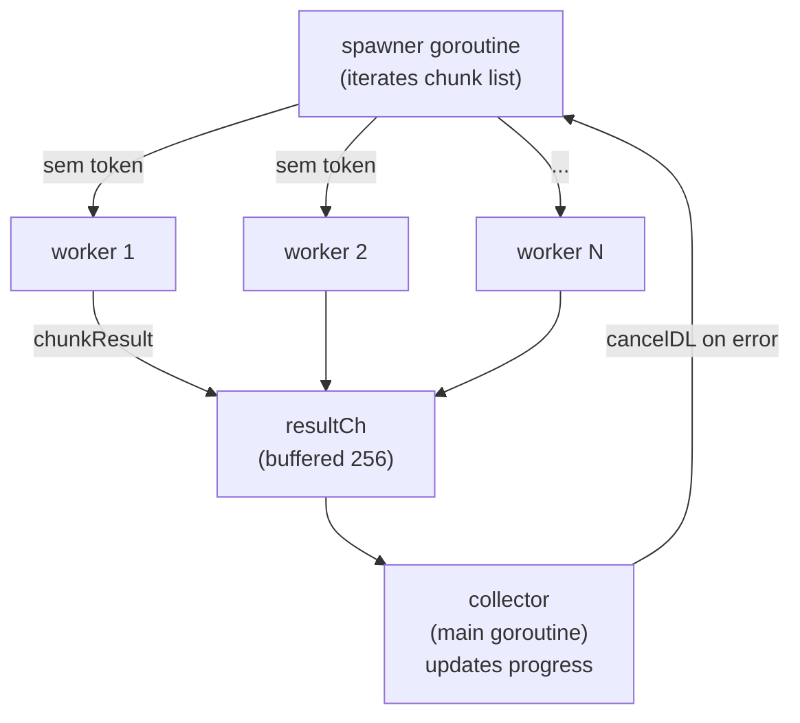

`MaxParallelChunks` (default: 8) controls the semaphore. The spawner and collector run concurrently so progress events fire as chunks complete, not only when all workers finish a batch.

### Error handling

| Error | Action |
|-------|--------|
| `errChunkUnauthorized` (HTTP 401) | Invalidate cached CDN token, re-fetch, retry once on same server |
| `errChunkCorrupt` (SHA-1 mismatch) | Penalise server, pick new server, retry once |
| Any other error | Penalise server, cancel all in-flight downloads, surface error to caller |

---

## Workshop Download Pipeline

Workshop items require an authenticated session because their depots are never anonymous.

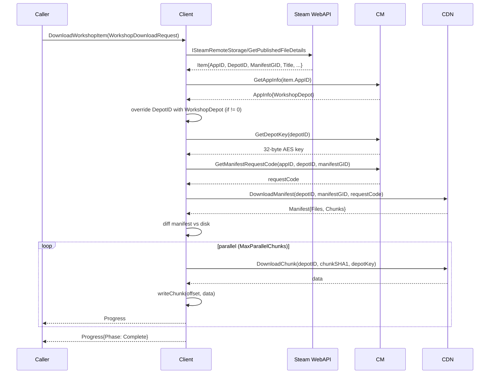

### WorkshopDownloadRequest

```go
type WorkshopDownloadRequest struct {
    ItemID    uint64 // Steam Published File ID
    TargetDir string // required
}
```

### Workshop depot resolution

Steam's WebAPI returns `consumer_app_id` as the depot ID in `GetPublishedFileDetails`. This is the game's app ID, not the actual workshop depot. The real workshop depot is stored in the app's PICS data under the `workshopdepot` key. The library looks this up via `GetAppInfo` and overrides the depot ID.

---

## Cache / Store

The `LocalCache` persists three categories of data as JSON under `CachePath`:

| File | Contents | TTL |
|------|----------|-----|
| `session_<username>.json` | `CachedSession` (access token, expiry) | Until token expires |
| `depotkeys.json` | `[]CachedDepotKey` (depot ID → 32-byte key) | Permanent (keys don't rotate) |
| `cdntokens.json` | `[]CachedToken` (host+depot → bearer token, expiry) | Until each token expires; also pruned on load |

```go
type CachedSession struct {
    AccountName string
    AccessToken string
    Expiry      time.Time
}

type CachedDepotKey struct {
    DepotID uint32
    Key     []byte // 32 bytes
}

type CachedToken struct {
    Host    string
    DepotID uint32
    Token   string
    Expiry  time.Time
}
```

All file access is serialised with a `sync.Mutex`.

---

## API Reference

### `steam.Config`

```go
type Config struct {
    Username           string
    Password           string
    SteamGuardCallback func(guardType, emailHint string) (string, error)
    CachePath          string          // default: ~/.cache/go-steam
    CellID             uint32          // CDN cell for geo-routing (default 0)
    MaxParallelChunks  uint            // default 8
    MaxParallelManifests uint          // default 4
    CMServers          []string        // override CM server list
    Log                *slog.Logger
}
```

### `steam.Client`

```go
func New(ctx context.Context, cfg Config) (*Client, error)
func (c *Client) Close()
func (c *Client) DownloadApp(ctx context.Context, req AppDownloadRequest) (<-chan Progress, error)
func (c *Client) DownloadWorkshopItem(ctx context.Context, req WorkshopDownloadRequest) (<-chan Progress, error)
```

### `steam.Progress`

```go
type Progress struct {
    Phase       Phase
    TotalBytes  int64
    DoneBytes   int64
    TotalChunks int
    DoneChunks  int
    CurrentFile string
    Err         error  // non-nil signals terminal failure
}

type Phase string
const (
    PhaseResolving   Phase = "resolving"
    PhaseManifest    Phase = "manifest"
    PhaseDiffing     Phase = "diffing"
    PhaseDownloading Phase = "downloading"
    PhaseComplete    Phase = "complete"
)
```

The returned channel is buffered (16 events). `Err != nil` on any event means the download failed; the channel will be closed immediately after. `Phase == PhaseComplete` with `Err == nil` means success.

### Steam Guard helpers

```go
// InteractiveSteamGuard prompts the user on stdin.
func InteractiveSteamGuard(guardType, emailHint string) (string, error)

// UnknownSteamGuard returns an error unconditionally (default when callback is nil).
func UnknownSteamGuard(guardType, emailHint string) (string, error)
```

For TOTP auto-generation without a callback, pass `-totp-secret` to the CLI or call the internal package directly:

```go
import "github.com/BirknerAlex/go-steam/internal/totp"

code, err := totp.GenerateAuthCode(base64Secret) // 5-character alphanumeric
```
